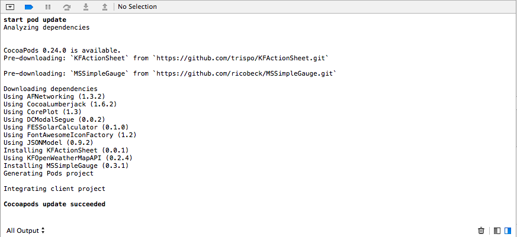
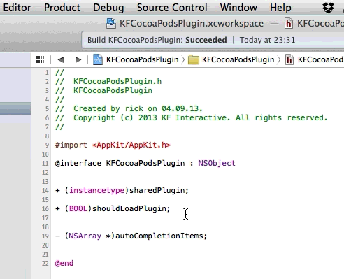
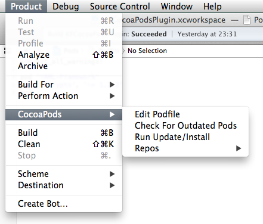
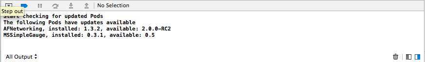
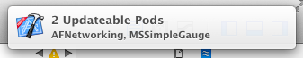

KFCocoaPodsPlugin
=================

XcodePlugin for CocoaPods with pod commands/console output, user notifications &amp; code completion.
.

#Requirements
Requires Xcode5. Xcode4 is not supported.

#Installation
Clone this repo or download the zip, run 'pod install' in the terminal, open the workspace file in Xcode and compile. After a restart of Xcode you have a 'CocoaPods' Menu Item in the Products menu.

#Features
* Check for outdated Pods from Xcode 
* Run Update/Install from Xcode
* Output of the supported Commands appears in the Xcode Debug Console
* Edit you Podfile with code completion (Pods and versions are taken from the installed CocoaPods Repos)  
  

#License
This code is distributed under the terms and conditions of the MIT license.

#Author
Rico Becker | @ricobeck https://twitter.com/ricobeck

#Acknowledgements
Inspired by the [CocoaPod Plugin][1].
Some information were taken from the awesome [KSImageNamed][2].
For executing commands [DSUnixTask][3] is used.

#Troubleshooting
When no command is executed you can try putting the path to your pod binary into .bashrc.

#Screenshots

Main Menu  
  
Console output   
  
NotificationCenter  

[1]: https://github.com/kattrali/cocoapods-xcode-plugin "CocoaPods Plugin Repo"
[2]: https://github.com/ksuther/KSImageNamed-Xcode "KSImageNamed Repo"
[3]: https://github.com/Discontinuity-srl/DSUnixTask
